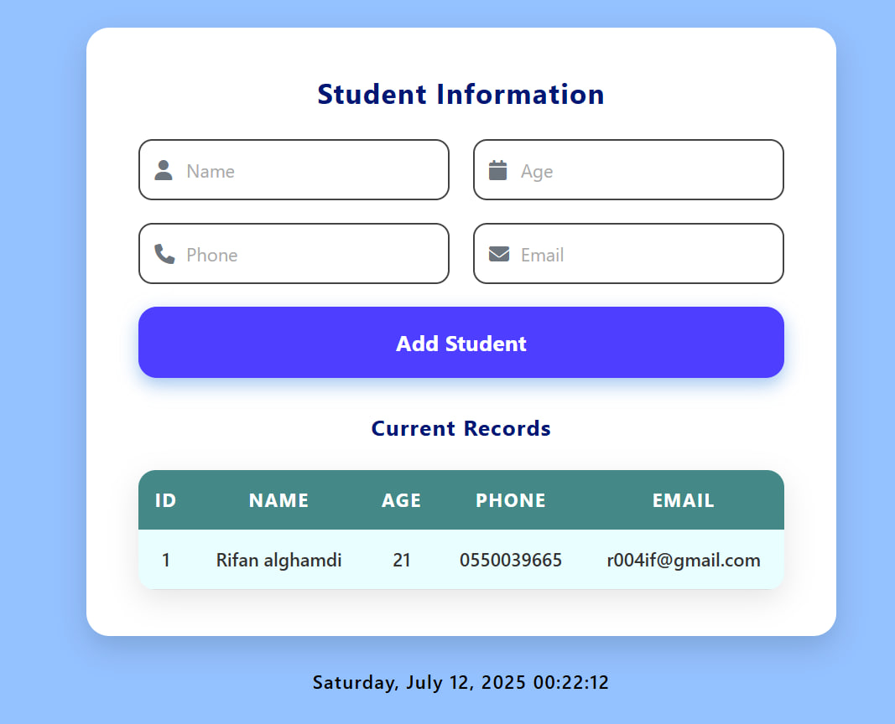
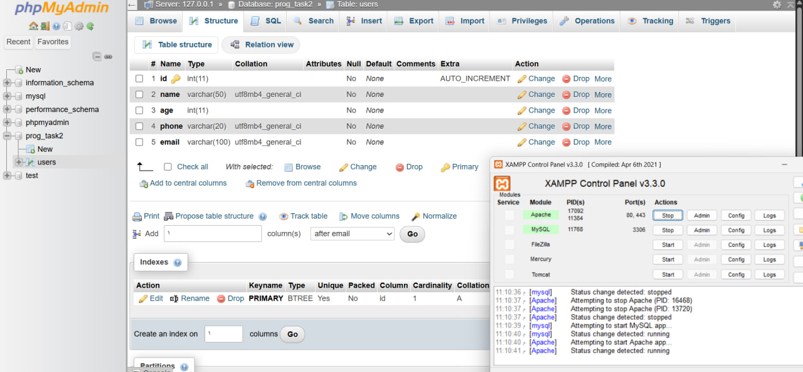

## Student Data Entry Web 

## 📸 Preview

### 🧾 Web Form Interface (localhost)  

### 🛠 XAMPP + Database Setup  

---

## 📝 Description

This web app is built using PHP, MySQL, and styled with CSS. The user can enter student data (Name, Age, Phone, Email) into a form. Upon submission, the data is inserted into a database and displayed in a table below the form. A success message appears when a student is added.

---

## ⚙️ Technologies Used

- 💻 PHP (backend logic)
- 🗃 MySQL (database)
- 🎨 HTML & CSS (frontend and design)
- 🧪 XAMPP (Apache server + MySQL service)
- 🌐 Localhost (via browser)

---

## 🚀 Setup Instructions

### 1️⃣ Install & Run XAMPP
- Download and install XAMPP.
- Open the XAMPP Control Panel.
- Start both Apache and MySQL services.

### 2️⃣ Create the Database
- Go to [localhost/phpmyadmin](http://localhost/phpmyadmin)
- Create a new database called: prog_task2
- Inside it, create a table named: users with the following columns:

| Column | Type       | Extra          |
|--------|------------|----------------|
| id     | INT        | PRIMARY KEY, AUTO_INCREMENT |
| name   | VARCHAR(50) | – |
| age    | INT        | – |
| phone  | VARCHAR(20) | – |
| email  | VARCHAR(100) | – |

### 3️⃣ Project Files

Place the following files in your htdocs/ai-task2 folder inside the XAMPP directory:

| File           | Description                       |
|----------------|-----------------------------------|
| index.php    | Main form and display page         |
| insert.php   | Handles form submission and database insert |
| style.css    | Styling for the form and table     |

### 4️⃣ Run the Web App

http://localhost/prog_task2

## 📋 Output Behavior

- ✅ Successful insert shows a green confirmation message.
- 📦 Data is saved to MySQL table.
- 🖥 Data is displayed below the form in real-time.
- 🕒 Current date and time are shown at the bottom of the page.
